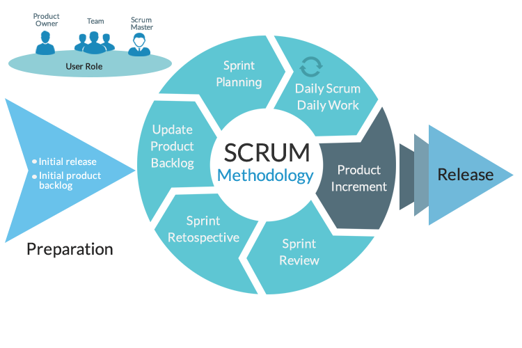
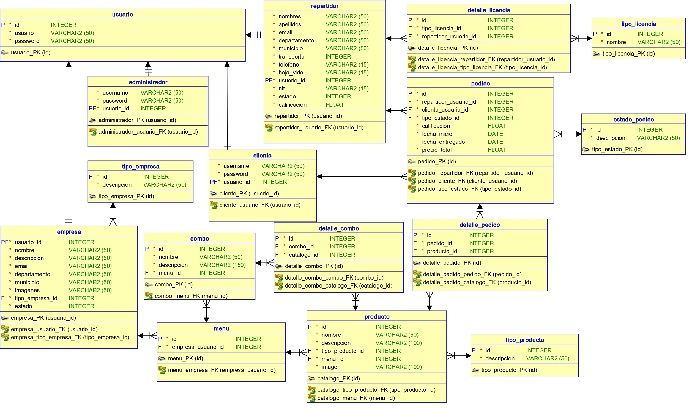
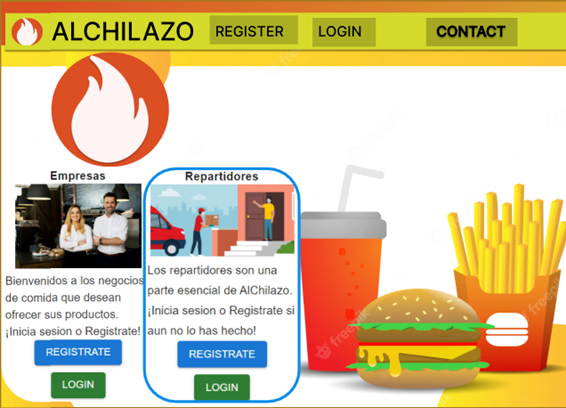
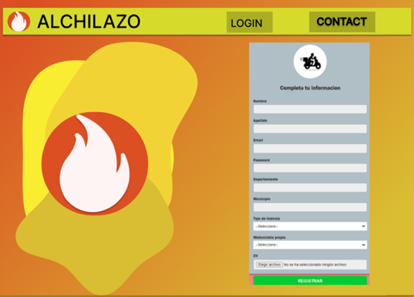
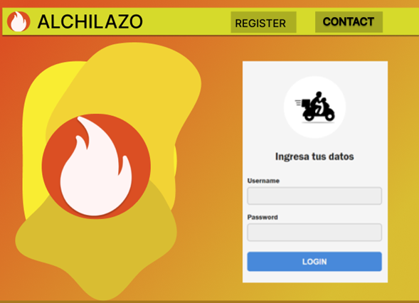
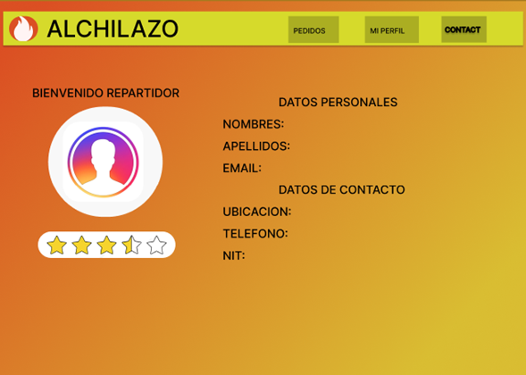
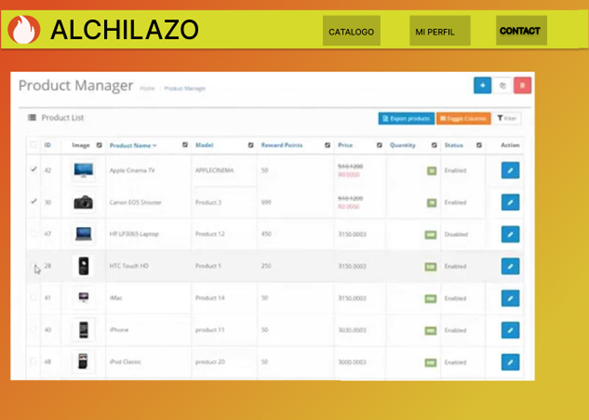

# PROYECTO - FASE 1
---
## INTEGRANTES
|NOMBRE|CARNET|
|:----------|:----------:|
|Juan Sebastian Julajuj Zelada|	201905711|
|Karen Lizbeth Morales Marroquin|	201908316|
|Oscar Daniel Oliva España|	201902663|
|Carlos Estuardo Monterroso Santos| 201903767|

---
# DOCUMENTACION


 # <center>SCRUM </center>
   

 - *Esta metodología es un marco de trabajo ágil que ayuda al equipo a trabajar en conjunto para el desarrollo de un proyecto.*

 - *Esta metodología proporcionó una serie de valores, roles y pautas que genera un ambiente adecuado para la convivencia, concentración y mejora continua del equipo durante el desarrollo del proyecto.*

 - *Esta metodología indica que se debe separar el proyecto por etapas **sprint** lo cual ayuda a reducir un poco la complejidad del proyecto tendiendo al final de cada etapa un entregable o un incremento de funcionalidades del producto.*

 - *Esta metodología da la opción de usar herramientas para gestionar el flujo de trabajo, dividiéndolo en tareas y asignándolas a uno o más responsables, asimismo la supervisión de las tareas por realizar, en proceso, en revisión o terminadas.*

 - *Esta metodología indica que se debe realizar una reunión al iniciar un sprint (sprint planning) en la cual se debe analizar y generar una lista con las funcionalidades requeridas sprint backlog, metas y objetivos.*

 - *Esta metodología indica que debe realizar reuniones diariamente (daily scrum) que permite saber el avance del sprint así como posibles complicaciones o errores que se generan durante el desarrollo de este, esto permite buscar soluciones con el equipo de ser necesario.*

 - *Esta metodología indica que debe realizar una reunión al finalizar el sprint (sprint review) en el cual se verifica las metas u objetivos planteados al inicio del sprint esto permitirá garantizar el correcto funcionamiento del producto.*

 - *esta metodología indica que se debe realizar una reunión al finalizar el sprint (spring retrospective) en el cual se debe analizar si se tuvo fallas a corregir o mejoras que aplicar al inicio del siguiente sprint y asimismo obtener mejora continua.*

<br>

# **Roles dentro de SCRUM**

   - **Product Owner**
       - *Determinar los requisitos generales y actividades iniciales del proyecto*
       - *Representar a los usuarios del producto;
       - *buscar y asegurar los recursos financieros que requiere el proyecto para iniciarse y desarrollarse*
       - *Analizar la viabilidad del emprendimiento*
       - *Garantizar que el producto se entregue*
       - *Desarrollar y establecer los criterios para aceptar las historias de los usuarios*
       - *Aprobar o negar los productos entregables*

   <br>

   - **Scrum Master**
       - *Tiene dos funciones principales dentro del marco de trabajo:*
           - *Gestionar el proceso Scrum*
           - *Ayudar a eliminar impedimentos que puedan afectar a la entrega del producto*
       - *A parte de ello se engarga de las siguientes labores:*
           - *Mentoring y formación*
           - *Coaching*
           - *Facilitar reuniones y eventos si es necesario*

   <br>

   - **Equipo de desarrollo**

       - *El equipo de desarrollo suele estar formado por entre 3 a 9 profesionales que **se encargan de desarrollar el producto, auto-organizándose y auto-gestionándose para conseguir entregar un incremento de software** al final del ciclo de desarrollo*
       - *El equipo de desarrollo se encargará de crear un incremento terminado a partir de los elementos del Product Backlog seleccionados (Sprint Backlog) durante el Sprint Planning*

 <br>

 # ***Porque usar SCRUM***

 *Esta metodología permite dividir en etapas el proyecto lo cual reduce un poco la complejidad de este, así mismo se dividen en tareas y haciendo uso de una herramienta para controlar el flujo de trabajo como trello en la que se indican las tareas a realizar, en proceso, en revisión y terminadas lo que brinda una imagen más clara del avance de la etapa. Además de la constante comunicación entre el equipo de trabajo debido a las diferentes reuniones que se realizan durante la ejecución de la etapa. Al finalizar una etapa se analizar cual fue desempeño del equipo de trabajo durante la etapa y determinar si se puede mejorar o corregir alguna falla cuando se inicie la siguiente etapa del proyecto, esto ayuda a tener una mejora contante al trabajar en equipo.*

<br>

 # <center> Modelo Branching </center>
### GitFlow

---


---


### Proceso de creación de flujo

> Main

La rama Main se crea por defecto al crear el repositorio del proyecto. En ella se hicieron varios commits con el fin de subir todo lo necesario para iniciar el proyecto. Al tener ya versiones en producción actualizamos la rama develop para que el siguiente desarrollador tuviera la ultima versión a trabajar y pudiera fusionarla con su rama.

___Crear proyecto -> Main___

> Develop

La rama develop se crea desde la rama main. En esta rama se fusionan las nuevas funcionalidades y modificaciones que elaboro cada desarrollador.

___Main -> Develop___

> Feature

Las rama feature se crean desde la rama develop. En total se hicieron 5 ramas feature, una para cada desarrollador, estas ramas se cada vez que se utilizaron se tenían que actualizar desde la develop, al agregar las funcionalidades y terminar subir los cambios en dicha rama, se fusionan con la rama develop.

___Develop -> Feature/x -> Develop___

> Release

Las rama release se crean desde la rama develop, las utilizamos para crear las nuevas versiones del software.

___Develop -> Release/x.y.z___

> Tag

Los tag se crean desde la rama main, los utilizamos para marcar las nuevas versiones de lanzamiento para uso de los usuarios.

___Release/x.y.z -> Main -> x.y.z (Tag)___

 # <center> Requerimientos </center>

  - **Antecedentes del proyecto**
    <br>
    Actualmente existen empresas que se puden dividir en 3 tipos: Restaurante

    Actualmente existen hoteles que ofresen su servicios a nivel global. A falta de una página que proporcione los servicios de viaje, estadía y transporte, nace el sistema ***Full trip***. Con la finalidad de poder ofrerle al turista diferentes opciones para que puedan adquirir el servicio y puedan calificarlo.
    <br>

  - **Necesidades**
    <br>
    Se require una página intuitiva y amigable para el usuario, el cual tiene que ser capaz de registrar usuarios y las empresas que desean registrar los servicios que se prestan a nivel goblal.
    <br>

  - **Funcionales**
        <br>

       |Nombre|Requerimiento   |Descripcion|Nivel de prioridad|
       |------|----------------|-----------|------------------|
       |RF01  |Inicio de sesion|La pagina contara con un *login* para acceder al usuaro por medio de correo o nombre usuario, al igual que la contraseña.|5|
       |RF01  |Registro de Usuario|Si el usuario no cuenta con registros en la pagina, se debera registrar ingresando la informacion que se le solicita (Nombre Completo, Usuario, Fecha de Nacimiento, Correo Electrónico,  Contraseña) y seleccionar que tipo de usuario desea ser.|5|

   <br>

   ## Funcionales

- Proporcionar a los usuarios un sistema funcional para realizar viajes
- Proveer a los usuarios una forma sencilla de entender y de utilizar para realizar viajes
- Registro de usuarios turista
- Registro de hoteles
- Registro de autos
- Registro de aerolineas
- Inicio de sesión de usuarios por rol
- Registro de servicios adicionales al sistema
- Buscador de hoteles
- Filtrar busqueda de hoteles por campos especificos
- Creación de habitaciones disponibles adicionales
- Ingreso de carros para renta para usuaio tipo renta autos
- Reserva de autos para turista
- Busqueda de autos para el usuario
- Filtro para busqueda de autos
- Crear vuelo por tipo
- Busqueda de vuelo
- Filtro para busqueda de vuelo
- Valorar y esribir reseña para vuelo, reservación hotel, auto y servicios adicionales
- Visualizar reseñas

## No Funcionales

- Centralización de datos para el cliente
- Minimización de validaciones para el cliente al momento de programar viaje
- Categorizar usuarios por roles
- Orden en el alquiler de habitaciones
- Solicitar campos necesarios por cada operación
- Diseño sensible de la aplicación y sus funcionalidades
- Seguridad para datos del usuario
- Soporte para multiple usuarios
- Correcto manejo de transacciones simultaneas
- Correcto acceso a reseñas de servicios utilizados
- Correcta confirmación de servicios seleccionados


# <center>Mapeo de Historias de usuario </center>
   


  # <center> Historias de usuario / criterios de aceptación. </center>
<br>


   - **Como usuario cliente debo poder registrarme y logearme a la pagina.**
       - *Se necesita que los usuarios puedan ingresar a la pagina de registro y de Login, para poder ingresar sus datos.*
   <br>
  - **Como usuario Repartidor debo poder registrarme con los datos que demuestren mis habilidades.**
       - *Se necesita desplegar un formulario con los datos relevantes, para que el repartidor pueda ingresar sus datos.*
   <br>

   - **Como administrador debo poder aceptar a repartidores y empresas, pudiendo verificar si sus datos son reales.**
       - *Se necesita que los administradores puedan aceptar o rechar a los usuarios repartidores y empresas.*
       - *Se necesita crear una tabla que muestre todas las solicitudes de usuarios de los repartidores que no hayan sido aceptados todavía.*
       - *Se necesita crear una tabla que muestre todas las solicitudes de usuarios de las empresas que no hayan sido aceptadas todavía.*

   - **Como administrador necesito poder ver los informes de los usuarios globales.**
       - *Se necesita crear una tabla con los datos generales de los usuarios, saber cuántos hay etc....*
   
   - **Como empresa necesito poder ver el catalogo de los.**
       - *Se necesita crear una tabla con los datos generales de los usuarios, saber cuántos hay etc....*


# Diagrama de Entidad Relacion
El siguiente diagrama es una representacion de la entidad relacion que se utilizara para la base de datos que se empleara en el proyecto.




# Mockups de las principales vistas para la página web.


* Landing Page


```Página que muestra la información general de inicio. ```
* Register Empresa

```Página que muestra el formulario para poder registrarse como empresa ```
- Registro Repartidor

```Es igual que para la empresa, solo que con datos de repartidores, como el tipo de licencia vehicular ```
- Login 

```El login es similar para todos los tipos de usuario, pero al ingresar los redirigirá a sus respectivas páginas.```
- Mi Perfil

```Muestra los datos de los usuarios, en general es el mismo para todos los tipos de usuario, solo que con sus respectivos campos.```
- Catalogo 

```Muestra como se ingresaran, eliminaran o editaran los productos de cada empresa.```


