# PROYECTO - FASE 1
---
## INTEGRANTES
|NOMBRE|CARNET|
|:----------|:----------:|
|Juan Sebastian Julajuj Zelada|	201905711|
|Karen Lizbeth Morales Marroquin|	201908316|
|Oscar Daniel Oliva España|	201902663|
|Carlos Estuardo Monterroso Santos| 201903767|

---
# DOCUMENTACION


 # <center>SCRUM </center>
   

 - *Esta metodología es un marco de trabajo ágil que ayuda al equipo a trabajar en conjunto para el desarrollo de un proyecto.*

 - *Esta metodología proporcionó una serie de valores, roles y pautas que genera un ambiente adecuado para la convivencia, concentración y mejora continua del equipo durante el desarrollo del proyecto.*

 - *Esta metodología indica que se debe separar el proyecto por etapas **sprint** lo cual ayuda a reducir un poco la complejidad del proyecto tendiendo al final de cada etapa un entregable o un incremento de funcionalidades del producto.*

 - *Esta metodología da la opción de usar herramientas para gestionar el flujo de trabajo, dividiéndolo en tareas y asignándolas a uno o más responsables, asimismo la supervisión de las tareas por realizar, en proceso, en revisión o terminadas.*

 - *Esta metodología indica que se debe realizar una reunión al iniciar un sprint (sprint planning) en la cual se debe analizar y generar una lista con las funcionalidades requeridas sprint backlog, metas y objetivos.*

 - *Esta metodología indica que debe realizar reuniones diariamente (daily scrum) que permite saber el avance del sprint así como posibles complicaciones o errores que se generan durante el desarrollo de este, esto permite buscar soluciones con el equipo de ser necesario.*

 - *Esta metodología indica que debe realizar una reunión al finalizar el sprint (sprint review) en el cual se verifica las metas u objetivos planteados al inicio del sprint esto permitirá garantizar el correcto funcionamiento del producto.*

 - *esta metodología indica que se debe realizar una reunión al finalizar el sprint (spring retrospective) en el cual se debe analizar si se tuvo fallas a corregir o mejoras que aplicar al inicio del siguiente sprint y asimismo obtener mejora continua.*

<br>

# **Roles dentro de SCRUM**

   - **Product Owner**
       - *Determinar los requisitos generales y actividades iniciales del proyecto*
       - *Representar a los usuarios del producto;
       - *buscar y asegurar los recursos financieros que requiere el proyecto para iniciarse y desarrollarse*
       - *Analizar la viabilidad del emprendimiento*
       - *Garantizar que el producto se entregue*
       - *Desarrollar y establecer los criterios para aceptar las historias de los usuarios*
       - *Aprobar o negar los productos entregables*

   <br>

   - **Scrum Master**
       - *Tiene dos funciones principales dentro del marco de trabajo:*
           - *Gestionar el proceso Scrum*
           - *Ayudar a eliminar impedimentos que puedan afectar a la entrega del producto*
       - *A parte de ello se engarga de las siguientes labores:*
           - *Mentoring y formación*
           - *Coaching*
           - *Facilitar reuniones y eventos si es necesario*

   <br>

   - **Equipo de desarrollo**

       - *El equipo de desarrollo suele estar formado por entre 3 a 9 profesionales que **se encargan de desarrollar el producto, auto-organizándose y auto-gestionándose para conseguir entregar un incremento de software** al final del ciclo de desarrollo*
       - *El equipo de desarrollo se encargará de crear un incremento terminado a partir de los elementos del Product Backlog seleccionados (Sprint Backlog) durante el Sprint Planning*

 <br>

 # ***Porque usar SCRUM***

 *Esta metodología permite dividir en etapas el proyecto lo cual reduce un poco la complejidad de este, así mismo se dividen en tareas y haciendo uso de una herramienta para controlar el flujo de trabajo como trello en la que se indican las tareas a realizar, en proceso, en revisión y terminadas lo que brinda una imagen más clara del avance de la etapa. Además de la constante comunicación entre el equipo de trabajo debido a las diferentes reuniones que se realizan durante la ejecución de la etapa. Al finalizar una etapa se analizar cual fue desempeño del equipo de trabajo durante la etapa y determinar si se puede mejorar o corregir alguna falla cuando se inicie la siguiente etapa del proyecto, esto ayuda a tener una mejora contante al trabajar en equipo.*

<br>

 # <center> Modelo Branching </center>
### GitFlow

---

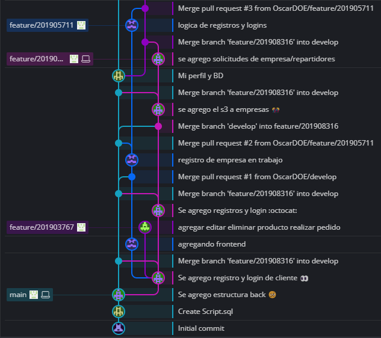

---


### Proceso de creación de flujo

> Main

La rama Main se crea por defecto al crear el repositorio del proyecto. En ella se hicieron varios commits con el fin de subir todo lo necesario para iniciar el proyecto. Al tener ya versiones en producción actualizamos la rama develop para que el siguiente desarrollador tuviera la ultima versión a trabajar y pudiera fusionarla con su rama.

___Crear proyecto -> Main___

> Develop

La rama develop se crea desde la rama main. En esta rama se fusionan las nuevas funcionalidades y modificaciones que elaboro cada desarrollador.

___Main -> Develop___

> Feature

Las rama feature se crean desde la rama develop. En total se hicieron 5 ramas feature, una para cada desarrollador, estas ramas se cada vez que se utilizaron se tenían que actualizar desde la develop, al agregar las funcionalidades y terminar subir los cambios en dicha rama, se fusionan con la rama develop.

___Develop -> Feature/x -> Develop___

> Release

Las rama release se crean desde la rama develop, las utilizamos para crear las nuevas versiones del software.

___Develop -> Release/x.y.z___

> Tag

Los tag se crean desde la rama main, los utilizamos para marcar las nuevas versiones de lanzamiento para uso de los usuarios.

___Release/x.y.z -> Main -> x.y.z (Tag)___

 # <center> Requerimientos </center>

  - **Antecedentes del proyecto**
    <br>
    Actualmente existen empresas que se puden dividir en 3 tipos: Restaurante, Tienda de conveniencia y Supermercados. A falta de una pagina que proporcione los servicios de pedidos a domicilio, nace el sistema ***AlChilazo 🔥***. Que tiene la finalidad de poder ofrecerle al cliente diferentes productos y poder adquirirlos.
    <br>

  - **Necesidades**
    <br>
    Se require una página intuitiva y amigable para el usuario, el cual tiene que ser capaz de registrar usuarios y las empresas que desean registrar los servicios que se prestan a nivel goblal, tambien se requiere registrar repartidores para poder entregar pedidos.
    <br>

  - **Funcionales**
        <br>

       |Nombre|Requerimiento   |Descripcion|Nivel de prioridad|
       |------|----------------|-----------|------------------|
       |RF01  |Inicio de sesion|La pagina contara con un *login* para usar el servicio por medio de username al igual que la contraseña.|5|
       |RF01  |Registro de Usuario|Si el usuario no cuenta con registros en la pagina, se debera registrar ingresando la informacion que se le solicita (Usuario, Contraseña)|5|
       |RF02  |Registro de repartidor|Si el repartidor desea ser parte del equipo debe registrarse en la pagina,ingresando la informacion que se le solicita, y esperar a ser revisado por un admin|5|
       |RF03  |Registro de empresa|Si la empresa desea ser parte del equipo debe registrarse en la pagina,ingresando la informacion que se le solicita, y esperar a ser revisado por un admin|5|

   <br>

   ## Funcionales

- Proporcionar a los usuarios un sistema funcional para realizar pedidos.
- Proveer a los usuarios una forma sencilla de entender y de utilizar el servicio
- Registro de usuarios
- Registro de repartidores
- Registro de emprpesas
- Inicio de sesión de usuarios
- Ingreso de productos para la venta
- Vista de informe de usuarios
- Aprobar o rechazar usuarios
- Vista de perfil de repartidor

## No Funcionales

- Categorizar usuarios por roles
- Solicitar campos necesarios por cada operación
- Diseño amigable de la aplicación y sus funcionalidades
- Seguridad para datos del usuario
- Correcto manejo de transacciones
- Correcto acceso a informes de usuarios
- Utilizacion de tokens de seguridad


# Mockups de las principales vistas para la página web.


* Landing Page
  


```Página que muestra la información general de inicio. ```

* Register Empresa
  


```Página que muestra el formulario para poder registrarse como empresa ```
- Registro Repartidor
  


```Es igual que para la empresa, solo que con datos de repartidores, como el tipo de licencia vehicular ```
- Login 
  


```El login es similar para todos los tipos de usuario, pero al ingresar los redirigirá a sus respectivas páginas.```
- Mi Perfil
  


```Muestra los datos de los usuarios, en general es el mismo para todos los tipos de usuario, solo que con sus respectivos campos.```

- Catalogo 


```Muestra como se ingresaran, eliminaran o editaran los productos de cada empresa.```

## Cliente

-  Escoger Empresa
  
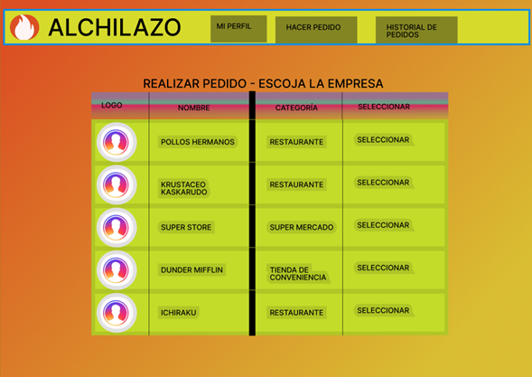

```Muestra como se escogerá alguna empresa que ofrezca los productos, para proceder a escoger los productos.```
-  Escoger Productos
  
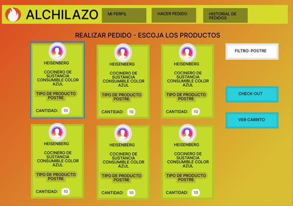

```Muestra como se escogerán los productos por parte del cliente y así agregarlos al pedido.```
-  Manejo del Carrito
  
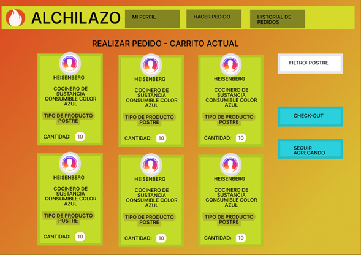

```Se muestran ls productos actuales que ha escogido el cliente para su pedido.```
-  Check-Out 
  
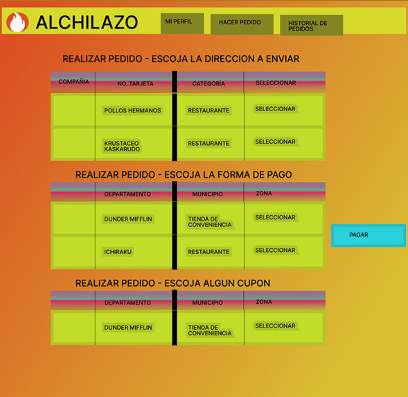

```Muestra la información del pago del pedido, en donde se pueden apreciar las direcciones asociadas al cliente, así como sus tarjetas de pago y si tiene algún cupón de descuento disponible.```
-  Calificar Pedidos
  
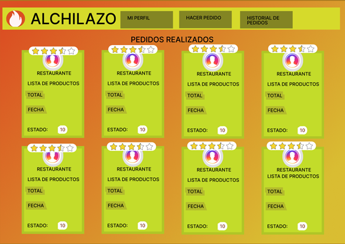

```Muestra todo el historial de pedidos, en donde podrá calificar cada pedido realizado.```
-  Agregar Preferencias
  
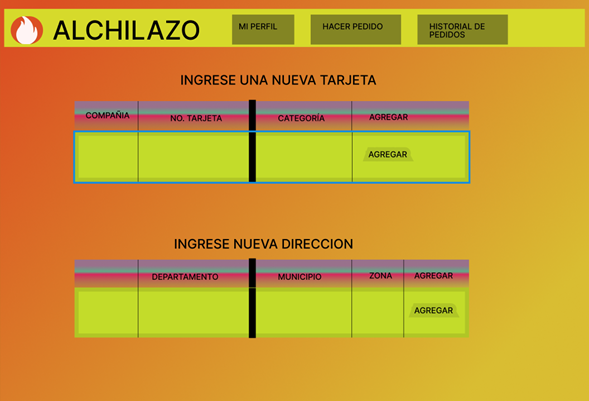

```Formulario en donde podrá agregar las preferencias de pago, así como las direcciones a las que enviar el pedido, y las tarjetas con las que realizará sus pagos.```

## Repartidor

-  Mi Perfil
  
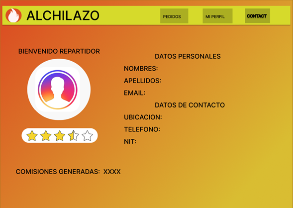

```Muestra los datos del perfil del usuario, así como su calificación actual y las comisiones generadas por sus entregas.```
-  Escoger Pedido
  
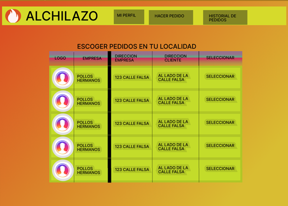

```Muestra todos los pedidos correspondientes a su zona, así como la dirección del cliente, la empresa y el nombre de la propia empreas.```
-  Historial de Pedidos 
  
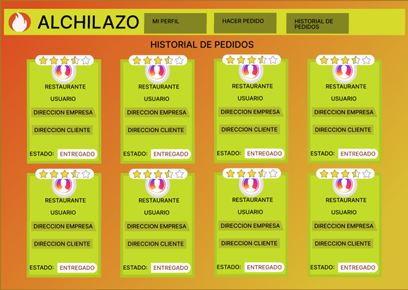

```Muestra la información del pago del pedido, en donde se pueden apreciar las direcciones asociadas al cliente, así como sus tarjetas de pago y si tiene algún cupón de descuento disponible.```
-  Solicitud de cambio de zona
  
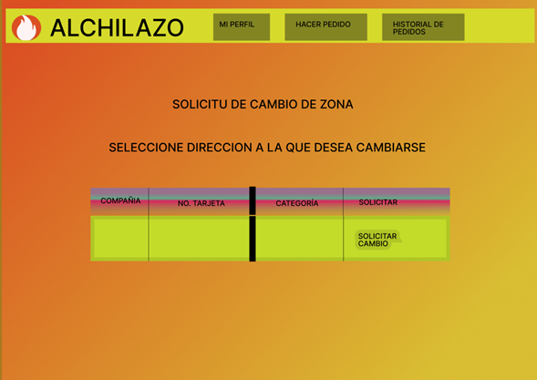

```Muestra un formulario en donde podrá agregar la nueva dirección a la que desea cambiarse, en dado tenga que mudarse o cualquier razón, la cual podrá ser aprobada por el administrador.```

## Administrador
-  Solicitudes de los usuarios
  
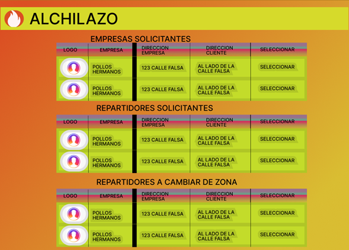

```Muestra diferentes tablas en donde se podrán aceptar solicitudes de los usuarios, tales como las empresas nuevas, los repartidores nuevos, y los repartidores que quieran cambiar de localidad.```
-  Cantidad de Usuarios y Deshabilitar Usuarios
  
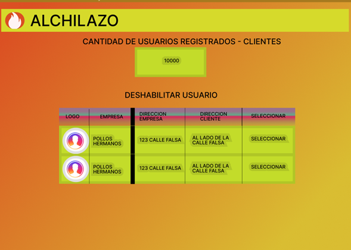

```Muestra la cantidad de usuarios clientes registrados, así también como la opción para deshabilitar usuarios.```
-  Top 5 de Repartidores y Empresas

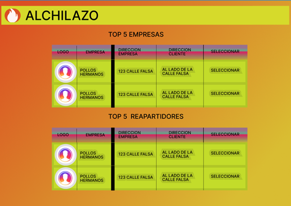

```Muestra una tablacon el top 5 de los repartidores con mejor calificación, así como de las 5 empresas con mayor cantidad de pedidos realizados.```


# Diagrama de Despliegue

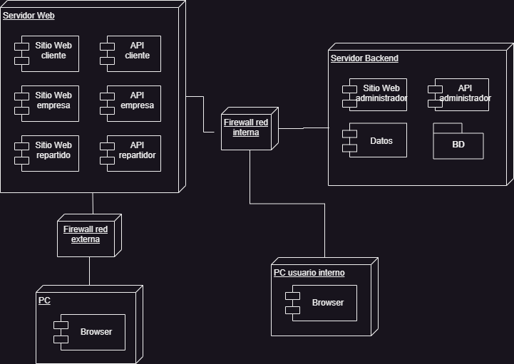

# User Story Mapping

- Primera fase 


- Segunda fase


  # <center> Historias de usuario / criterios de aceptación. </center>
<br>

   - **Como usuario cliente debo poder registrarme y logearme a la pagina.**
       - *Se necesita que los usuarios puedan ingresar a la pagina de registro y de Login, para poder ingresar sus datos.*
   <br>
  - **Como usuario Repartidor debo poder registrarme con los datos que demuestren mis habilidades.**
       - *Se necesita desplegar un formulario con los datos relevantes, para que el repartidor pueda ingresar sus datos.*
   <br>

   - **Como administrador debo poder aceptar a repartidores y empresas, pudiendo verificar si sus datos son reales.**
       - *Se necesita que los administradores puedan aceptar o rechar a los usuarios repartidores y empresas.*
       - *Se necesita crear una tabla que muestre todas las solicitudes de usuarios de los repartidores que no hayan sido aceptados todavía.*
       - *Se necesita crear una tabla que muestre todas las solicitudes de usuarios de las empresas que no hayan sido aceptadas todavía.*

   - **Como administrador necesito poder ver los informes de los usuarios globales.**
       - *Se necesita crear una tabla con los datos generales de los usuarios, saber cuántos hay etc....*
   
   - **Como empresa necesito poder ver el catalogo con mis productos.**
       - *Se necesita crear una tabla que muestre los productos existentes de la empresa*
   - **Como empresa necesito poder agregar productos al catalogo.**
       - *Se necesita crear un formulario para agregar nuevos productos al catalogo*
   - **Como empresa necesito poder editar/eliminar productos del catalogo.**
       - *Se necesita agregar un botón para editar/eliminar para cada producto, en caso de editar, solo se editará el precio y la disponibilidad.*
  - **Como empresa necesito poder agregar combos en base a mis productos previamente añadidos.**
       - *Se necesita agregar una página para poder agregar y visualizar los combos de la empresa.*
       - *Para agregar productos al combo se deberán de mostrar un choice con la lista de productos.*
## Rol de Usuario

### Historia de Usuario 1: Navegar entre productos | categorías
Como usuario, quiero poder navegar fácilmente por los productos y categorías de la plataforma para encontrar lo que estoy buscando.

### Historia de Usuario 2: Pedir producto
Como usuario, quiero poder seleccionar y pedir un producto específico de la plataforma.

### Historia de Usuario 3: Manejar carrito
Como usuario, quiero poder agregar, eliminar o modificar los productos en mi carrito de compras antes de realizar el pedido.

### Historia de Usuario 4: Agregar cupón
Como usuario, quiero poder ingresar un código de cupón válido durante el proceso de compra para obtener un descuento.

### Historia de Usuario 5: Historial de pedidos
Como usuario, quiero poder ver mi historial de pedidos anteriores para hacer un seguimiento de mis compras.

### Historia de Usuario 6: Calificar
Como usuario, quiero poder calificar y dejar comentarios sobre los productos y servicios que he recibido.

## Rol de Repartidor

### Historia de Usuario 7: Ver calificación
Como repartidor, quiero poder ver las calificaciones y comentarios que los usuarios han dejado sobre mis servicios de entrega.

### Historia de Usuario 8: Seleccionar pedido a entregar
Como repartidor, quiero poder seleccionar un pedido específico para entregar, considerando la zona en la que me encuentro y la ubicación del cliente.

### Historia de Usuario 9: Solicitud de cambio de zona
Como repartidor, quiero poder solicitar un cambio de zona de entrega si considero que sería más eficiente o conveniente.

### Historia de Usuario 10: Historial de pedidos
Como repartidor, quiero poder acceder a un historial de los pedidos que he entregado para hacer un seguimiento de mis actividades.

### Historia de Usuario 11: Comisiones generadas
Como repartidor, quiero poder ver las comisiones que he generado a través de mis entregas.

## Rol de Empresa

### Historia de Usuario 12: Aprobar pedido
Como empresa, quiero poder revisar y aprobar los pedidos realizados por los usuarios antes de procesarlos.

### Historia de Usuario 13: Reportes - Informe de producto más vendido
Como empresa, quiero poder generar un informe que muestre cuál es el producto más vendido en un período de tiempo específico.

### Historia de Usuario 14: Reportes - Historial de pedidos
Como empresa, quiero poder acceder a un informe que muestre el historial de todos los pedidos realizados en la plataforma.

## Rol de Administrador

### Historia de Usuario 15: Deshabilitar usuario
Como administrador, quiero poder deshabilitar la cuenta de un usuario en caso de que infrinja las normas o reglas de la plataforma.

### Historia de Usuario 16: Reportes - TOP 5 de las empresas que más pedidos generan
Como administrador, quiero poder generar un informe que muestre las cinco empresas que han generado la mayor cantidad de pedidos en un período de tiempo específico.

### Historia de Usuario 17: Reportes - Informe de los productos más vendidos
Como administrador, quiero poder generar un informe que muestre cuáles son los productos más vendidos en un período de tiempo específico.

### Historia de Usuario 18: Informes de repartidores - TOP 5 de los mejores delivery
Como administrador, quiero poder generar un informe que muestre los cinco mejores repartidores en función de sus calificaciones y desempeño.

### Historia de Usuario 19: Autenticación de Usuarios
Como administrador, quiero asegurarme de que los usuarios se autentiquen correctamente antes de acceder a la plataforma y realizar acciones.


# Diagrama de Entidad Relacion
El siguiente diagrama es una representacion de la entidad relacion que se utilizara para la base de datos que se empleara en el proyecto.


# Tecnologias Usadas
## Frontend
Para el desarrollo del frontend de la aplicación web, hemos utilizado React. React es una biblioteca de JavaScript para construir interfaces de usuario interactivas. Utiliza un enfoque basado en componentes, donde cada componente representa una parte de la interfaz. React utiliza un modelo de programación declarativo y eficiente gracias a su Virtual DOM. Es ampliamente utilizado en el desarrollo web moderno y proporciona herramientas para gestionar el estado de la aplicación y el enrutamiento.
## Backend
En cuanto al backend de la aplicación, hemos utilizado Nodejs. Nodejs es un entorno de ejecución de JavaScript del lado del servidor, basado en el motor V8 de Google Chrome. Permite construir aplicaciones escalables y de alto rendimiento. Node.js utiliza un modelo de E/S sin bloqueo y basado en eventos, lo que lo hace ideal para aplicaciones en tiempo real y con una gran cantidad de conexiones simultáneas. Además, cuenta con un amplio ecosistema de módulos y bibliotecas que facilitan el desarrollo de aplicaciones web y servicios backend.
## Base de Datos
RDS (Relational Database Service) con MySQL es un servicio de bases de datos en la nube de Amazon Web Services (AWS). Proporciona una instancia de base de datos MySQL totalmente administrada, escalable y segura. RDS simplifica la administración de la base de datos al encargarse de tareas como la configuración, el escalado y las copias de seguridad. Ofrece alta disponibilidad, rendimiento y flexibilidad para almacenar y recuperar datos de manera eficiente en aplicaciones y servicios basados en MySQL.

## Tests
Se utilizó la herramienta de `jest` con `supertest`  de `nodejs` para realizar las pruebas de los endpoints utillizados, validando todos los errores y respuestas que se hayan recibido por parte del backend.

# Arquitectura
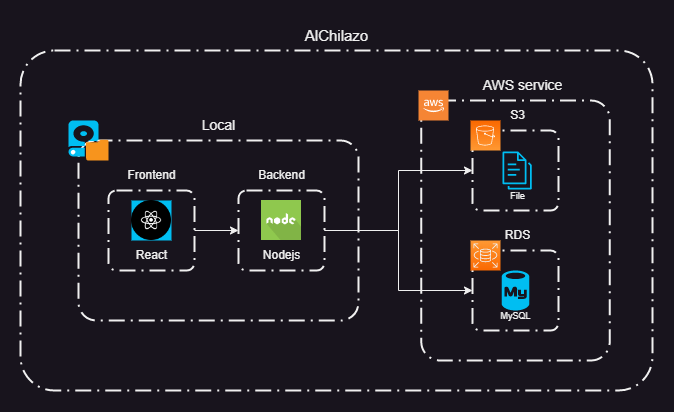

# Herramienta de gestion de proyectos
## Azure DevOps
Azure DevOps es una plataforma integral de desarrollo de software basada en la nube de Microsoft. Proporciona un conjunto de herramientas y servicios que permiten la planificación, desarrollo, pruebas, implementación y seguimiento de aplicaciones. Incluye capacidades de gestión de proyectos, control de versiones, compilación y entrega continua, pruebas automatizadas, seguimiento de problemas y más. Azure DevOps fomenta la colaboración entre equipos, mejora la productividad y ayuda a entregar software de alta calidad de manera eficiente.
### ***Tablero***
Se utilizó el manejador de Azure DevOps para llevar el control del proyecto y todos sus procesos.
https://dev.azure.com/krenmoraleja/krenmoraleja/_backlogs/backlog/krenmoraleja%20Team/Epics

# Diagrama de Despliegue

