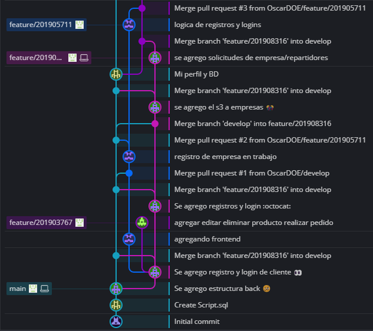
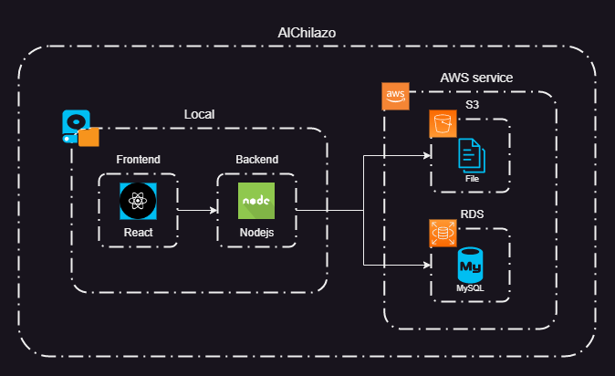

# PROYECTO - FASE 1
---
## INTEGRANTES
|NOMBRE|CARNET|
|:----------|:----------:|
|Juan Sebastian Julajuj Zelada|	201905711|
|Karen Lizbeth Morales Marroquin|	201908316|
|Oscar Daniel Oliva España|	201903663|
|Carlos Estuardo Monterroso Santos| 201903767|

---
# DOCUMENTACION

 # 
SCRUM 

   

 - *Esta metodología es un marco de trabajo ágil que ayuda al equipo a trabajar en conjunto para el desarrollo de un proyecto.*

 - *Esta metodología proporcionó una serie de valores, roles y pautas que genera un ambiente adecuado para la convivencia, concentración y mejora continua del equipo durante el desarrollo del proyecto.*

 - *Esta metodología indica que se debe separar el proyecto por etapas **sprint** lo cual ayuda a reducir un poco la complejidad del proyecto tendiendo al final de cada etapa un entregable o un incremento de funcionalidades del producto.*

 - *Esta metodología da la opción de usar herramientas para gestionar el flujo de trabajo, dividiéndolo en tareas y asignándolas a uno o más responsables, asimismo la supervisión de las tareas por realizar, en proceso, en revisión o terminadas.*

 - *Esta metodología indica que se debe realizar una reunión al iniciar un sprint (sprint planning) en la cual se debe analizar y generar una lista con las funcionalidades requeridas sprint backlog, metas y objetivos.*

 - *Esta metodología indica que debe realizar reuniones diariamente (daily scrum) que permite saber el avance del sprint así como posibles complicaciones o errores que se generan durante el desarrollo de este, esto permite buscar soluciones con el equipo de ser necesario.*

 - *Esta metodología indica que debe realizar una reunión al finalizar el sprint (sprint review) en el cual se verifica las metas u objetivos planteados al inicio del sprint esto permitirá garantizar el correcto funcionamiento del producto.*

 - *esta metodología indica que se debe realizar una reunión al finalizar el sprint (spring retrospective) en el cual se debe analizar si se tuvo fallas a corregir o mejoras que aplicar al inicio del siguiente sprint y asimismo obtener mejora continua.*

 

# **Roles dentro de SCRUM**

   - **Product Owner**
       - *Determinar los requisitos generales y actividades iniciales del proyecto*
       - *Representar a los usuarios del producto;
       - *buscar y asegurar los recursos financieros que requiere el proyecto para iniciarse y desarrollarse*
       - *Analizar la viabilidad del emprendimiento*
       - *Garantizar que el producto se entregue*
       - *Desarrollar y establecer los criterios para aceptar las historias de los usuarios*
       - *Aprobar o negar los productos entregables*

    

   - **Scrum Master**
       - *Tiene dos funciones principales dentro del marco de trabajo:*
           - *Gestionar el proceso Scrum*
           - *Ayudar a eliminar impedimentos que puedan afectar a la entrega del producto*
       - *A parte de ello se engarga de las siguientes labores:*
           - *Mentoring y formación*
           - *Coaching*
           - *Facilitar reuniones y eventos si es necesario*

    

   - **Equipo de desarrollo**

       - *El equipo de desarrollo suele estar formado por entre 3 a 9 profesionales que **se encargan de desarrollar el producto, auto-organizándose y auto-gestionándose para conseguir entregar un incremento de software** al final del ciclo de desarrollo*
       - *El equipo de desarrollo se encargará de crear un incremento terminado a partir de los elementos del Product Backlog seleccionados (Sprint Backlog) durante el Sprint Planning*

  

 # ***Porque usar SCRUM***

 *Esta metodología permite dividir en etapas el proyecto lo cual reduce un poco la complejidad de este, así mismo se dividen en tareas y haciendo uso de una herramienta para controlar el flujo de trabajo como trello en la que se indican las tareas a realizar, en proceso, en revisión y terminadas lo que brinda una imagen más clara del avance de la etapa. Además de la constante comunicación entre el equipo de trabajo debido a las diferentes reuniones que se realizan durante la ejecución de la etapa. Al finalizar una etapa se analizar cual fue desempeño del equipo de trabajo durante la etapa y determinar si se puede mejorar o corregir alguna falla cuando se inicie la siguiente etapa del proyecto, esto ayuda a tener una mejora contante al trabajar en equipo.*

 

 # 
 Modelo Branching 

### GitFlow

---

---

### Proceso de creación de flujo

> Main

La rama Main se crea por defecto al crear el repositorio del proyecto. En ella se hicieron varios commits con el fin de subir todo lo necesario para iniciar el proyecto. Al tener ya versiones en producción actualizamos la rama develop para que el siguiente desarrollador tuviera la ultima versión a trabajar y pudiera fusionarla con su rama.

___Crear proyecto -> Main___

> Develop

La rama develop se crea desde la rama main. En esta rama se fusionan las nuevas funcionalidades y modificaciones que elaboro cada desarrollador.

___Main -> Develop___

> Feature

Las rama feature se crean desde la rama develop. En total se hicieron 5 ramas feature, una para cada desarrollador, estas ramas se cada vez que se utilizaron se tenían que actualizar desde la develop, al agregar las funcionalidades y terminar subir los cambios en dicha rama, se fusionan con la rama develop.

___Develop -> Feature/x -> Develop___

> Release

Las rama release se crean desde la rama develop, las utilizamos para crear las nuevas versiones del software.

___Develop -> Release/x.y.z___

> Tag

Los tag se crean desde la rama main, los utilizamos para marcar las nuevas versiones de lanzamiento para uso de los usuarios.

___Release/x.y.z -> Main -> x.y.z (Tag)___

 # 
 Requerimientos 

  - **Antecedentes del proyecto**
     
    Actualmente existen empresas que se puden dividir en 3 tipos: Restaurante, Tienda de conveniencia y Supermercados. A falta de una pagina que proporcione los servicios de pedidos a domicilio, nace el sistema ***AlChilazo 🔥***. Que tiene la finalidad de poder ofrecerle al cliente diferentes productos y poder adquirirlos.
     

  - **Necesidades**
     
    Se require una página intuitiva y amigable para el usuario, el cual tiene que ser capaz de registrar usuarios y las empresas que desean registrar los servicios que se prestan a nivel goblal, tambien se requiere registrar repartidores para poder entregar pedidos.
     

  - **Funcionales**
         

       |Nombre|Requerimiento   |Descripcion|Nivel de prioridad|
       |------|----------------|-----------|------------------|
       |RF01  |Inicio de sesion|La pagina contara con un *login* para usar el servicio por medio de username al igual que la contraseña.|5|
       |RF01  |Registro de Usuario|Si el usuario no cuenta con registros en la pagina, se debera registrar ingresando la informacion que se le solicita (Usuario, Contraseña)|5|
       |RF02  |Registro de repartidor|Si el repartidor desea ser parte del equipo debe registrarse en la pagina,ingresando la informacion que se le solicita, y esperar a ser revisado por un admin|5|
       |RF03  |Registro de empresa|Si la empresa desea ser parte del equipo debe registrarse en la pagina,ingresando la informacion que se le solicita, y esperar a ser revisado por un admin|5|

    

   ## Funcionales

- Proporcionar a los usuarios un sistema funcional para realizar pedidos.
- Proveer a los usuarios una forma sencilla de entender y de utilizar el servicio
- Registro de usuarios
- Registro de repartidores
- Registro de emprpesas
- Inicio de sesión de usuarios
- Ingreso de productos para la venta
- Vista de informe de usuarios
- Aprobar o rechazar usuarios
- Vista de perfil de repartidor

## No Funcionales

- Categorizar usuarios por roles
- Solicitar campos necesarios por cada operación
- Diseño amigable de la aplicación y sus funcionalidades
- Seguridad para datos del usuario
- Correcto manejo de transacciones
- Correcto acceso a informes de usuarios
- Utilizacion de tokens de seguridad

# Tecnologias Usadas
## Frontend
Para el desarrollo del frontend de la aplicación web, hemos utilizado React. React es una biblioteca de JavaScript para construir interfaces de usuario interactivas. Utiliza un enfoque basado en componentes, donde cada componente representa una parte de la interfaz. React utiliza un modelo de programación declarativo y eficiente gracias a su Virtual DOM. Es ampliamente utilizado en el desarrollo web moderno y proporciona herramientas para gestionar el estado de la aplicación y el enrutamiento.
## Backend
En cuanto al backend de la aplicación, hemos utilizado Nodejs. Nodejs es un entorno de ejecución de JavaScript del lado del servidor, basado en el motor V8 de Google Chrome. Permite construir aplicaciones escalables y de alto rendimiento. Node.js utiliza un modelo de E/S sin bloqueo y basado en eventos, lo que lo hace ideal para aplicaciones en tiempo real y con una gran cantidad de conexiones simultáneas. Además, cuenta con un amplio ecosistema de módulos y bibliotecas que facilitan el desarrollo de aplicaciones web y servicios backend.
## Base de Datos
RDS (Relational Database Service) con MySQL es un servicio de bases de datos en la nube de Amazon Web Services (AWS). Proporciona una instancia de base de datos MySQL totalmente administrada, escalable y segura. RDS simplifica la administración de la base de datos al encargarse de tareas como la configuración, el escalado y las copias de seguridad. Ofrece alta disponibilidad, rendimiento y flexibilidad para almacenar y recuperar datos de manera eficiente en aplicaciones y servicios basados en MySQL.

# Arquitectura

# Herramienta de gestion de proyectos
## Azure DevOps
Azure DevOps es una plataforma integral de desarrollo de software basada en la nube de Microsoft. Proporciona un conjunto de herramientas y servicios que permiten la planificación, desarrollo, pruebas, implementación y seguimiento de aplicaciones. Incluye capacidades de gestión de proyectos, control de versiones, compilación y entrega continua, pruebas automatizadas, seguimiento de problemas y más. Azure DevOps fomenta la colaboración entre equipos, mejora la productividad y ayuda a entregar software de alta calidad de manera eficiente.